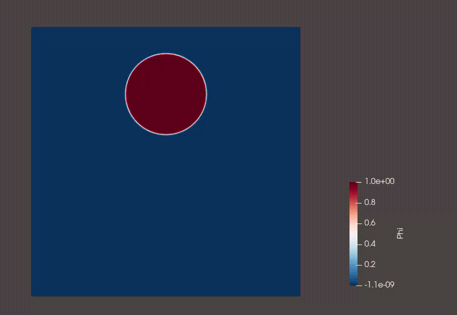

# Phase Field Simulation Code

A high-performance phase field simulation code for modeling two phase flows with Kokkos. Based on 
```
Suhas S. Jain,
Accurate conservative phase-field method for simulation of two-phase flows,
Journal of Computational Physics, Volume 469, 2022, 111529, ISSN 0021-9991,
https://doi.org/10.1016/j.jcp.2022.111529.
```

## Features

- **2D/3D simulations** of phase field models for solidification
- **Flexible boundary conditions**: Dirichlet, Neumann, and Periodic
- **Configurable grid**: Uniform and non-uniform mesh support
- **Multiple numerical schemes** for spatial discretization
- **Automatic output** to Tecplot format for visualization
  
## Future Plans 
 Full Navier Stokes solution. We pretty much have everything we need in calculators. 
 Implement an RK4 based timestepping procedure.

## Requirements

- C++14 or later
- Kokkos library
- CUDA (for GPU execution, optional)

## Building
Go to the src folder and make 
```bash
make -j8
```

## Usage

Create an input file (e.g., `input.dat`) with simulation parameters:

```
Nx = 128
Ny = 128
Nz = 1
dt = 0.001
nsteps = 10000
```

Run the simulation:

```bash
./phasefield2d
```

## Output

Results are written to the `TECOUT/` directory in Tecplot ASCII format:
- `phase.0000000.dat`, `phase.0000001.dat`, etc.
## Animation: 
Droplet in a shear flow, grid size: 500 x 500: 


## Features

- **2D/3D simulations** of phase field models 
- **Flexible boundary conditions**: Dirichlet, Neumann, and Periodic
- **Configurable grid**: Uniform and non-uniform mesh support
- **Multiple numerical schemes** for spatial discretization
- **Automatic output** to Tecplot format for visualization

## Requirements

- C++14 or later
- Kokkos library
- CUDA (for GPU execution, optional)

## Building

```bash
mkdir build
cd build
cmake ..
make
```

## Usage

Create an input file (e.g., `input.dat`) with simulation parameters:

```
Nx = 128
Ny = 128
Nz = 1
dt = 0.001
nsteps = 10000
```

Run the simulation:

```bash
./phasefield input.dat
```

## Output

Results are written to the `TECOUT/` directory in Tecplot ASCII format:
- `phase.0000000.dat`, `phase.0000001.dat`, etc.

